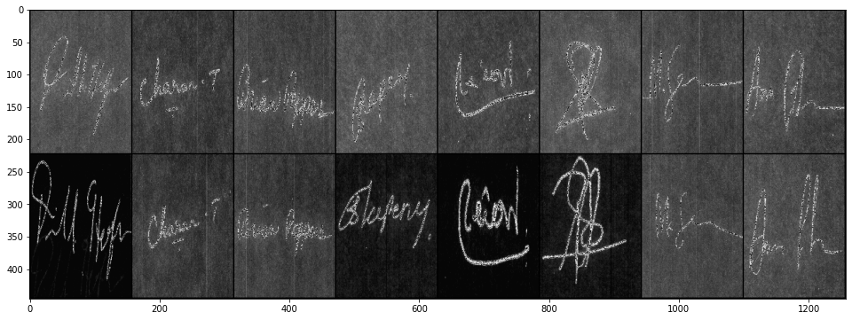

# signature-verification-siamese-network

This repository implements a convolutional siamese network for the offline signature verification problem. It takes inspiration from the [`SigNet`](https://arxiv.org/pdf/1707.02131.pdf) 1
paper for developing the convolutional network. The dataset used is the CEDAR signature database 2.

### Dataset description

Total 55 signers. Each signer has 24 genuine and 24 forged signature images.

### Experimental protocol

Currently, the division of the whole dataset into training and testing sets follows the method from the original paper. Specifically, the steps are:

- Randomly select M signers out of K signers.
- Both, original and forged signature images of the selected M signers are labelled *training* sets.
- The original and forged signature images of the remaining K - M signers are used as the *testing* set.

(For the CEDAR dataset, K = 55, M = 50).

### Image pair generation

For each signer, the pairs are generated as follows:

- All two-element combinations of the 24 genuine signatures are made - they form *positive* samples.
  - 24 C 2 combinations = 276.
- Corresponding to each genuine signature, a forged signature is used to form a set of *negative* samples.
  - 24 * 24 = 576.

Since the above procedure generates more negative samples (576) than positive samples (276), 276 random samples are selected from the negative sample set to prevent unbalance.

### References

[1] https://arxiv.org/pdf/1707.02131.pdf  
[2] https://cedar.buffalo.edu/NIJ/data/
